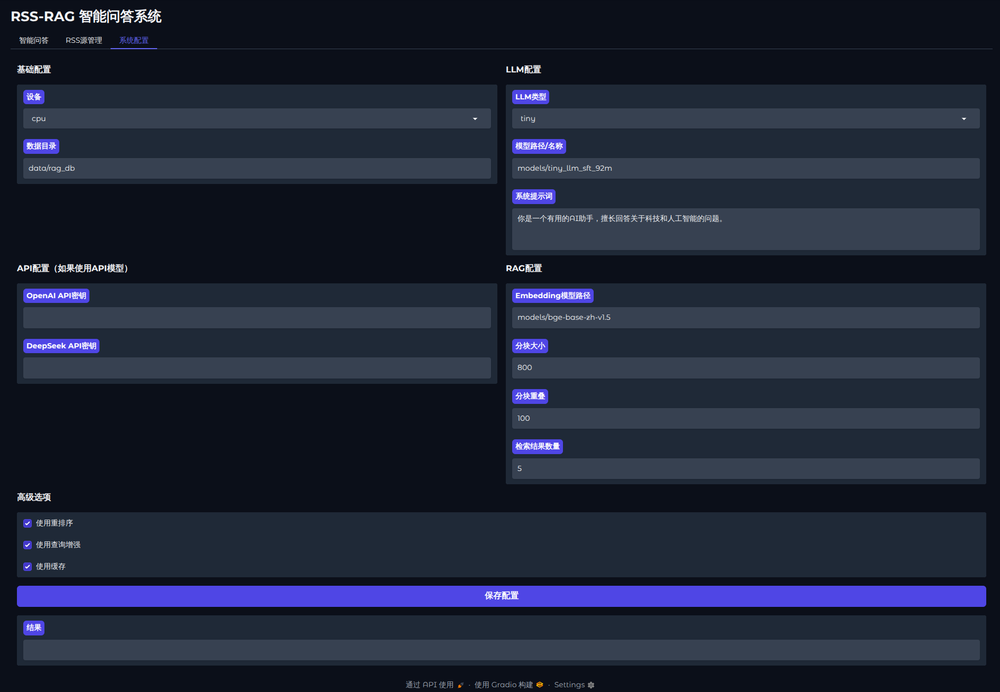

# RSS-RAG 智能问答系统

基于RSS数据源的检索增强生成(RAG)系统，通过Gradio提供用户界面，实现智能问答功能。



## 功能特点

- 支持添加、管理和更新RSS源
  - 单个添加RSS源
  - 批量导入OPML格式的RSS源
  - 分类管理
- 自动解析和存储RSS条目
- 基于向量检索的智能问答
  - 混合检索策略（BM25 + 向量检索）
  - 元数据过滤（按时间、来源等）
  - 支持多种LLM（OpenAI、HuggingFace模型、本地小型模型）
- 简洁易用的命令行工具
- 友好的Gradio用户界面
- 支持流式输出回答

## 安装

1. 克隆仓库：

```bash
git clone https://github.com/yourusername/rss-rag.git
cd rss-rag
```

2. 安装依赖：

```bash
pip install -r requirements.txt
```

3. 下载必要的模型：

```bash
# 下载Embedding模型
git clone https://huggingface.co/BAAI/bge-base-zh-v1.5 models/bge-base-zh-v1.5

# 下载LLM模型（可选，如果使用本地模型）
git clone https://huggingface.co/Qwen/Qwen-1_8B-Chat models/Qwen-1_8B-Chat
```

## 使用方法

### 初始化数据库

```bash
python main.py --setup
```

或者：

```bash
python scripts/cli.py setup
```

### 命令行工具

RSS-RAG提供了一个功能丰富的命令行工具，用于管理RSS源和条目：

```bash
python scripts/cli.py [命令] [参数]
```

可用命令：

- `setup`: 初始化数据库
- `add`: 添加RSS源
- `import`: 导入OPML文件
- `list`: 列出所有RSS源
- `delete`: 删除RSS源
- `update`: 更新所有RSS源
- `entries`: 列出条目
- `view`: 查看条目详情
- `mark-read`: 标记条目为已读
- `export`: 导出数据
- `ask`: 提问问题（RAG功能）

### 启动Web界面

```bash
python run_ui.py
```

## 项目结构

```
rss-rag/
├── data/                  # 数据存储目录
│   ├── rss.db             # SQLite数据库
│   └── vector_store/      # 向量数据库存储
├── models/                # 模型存储目录
│   ├── bge-base-zh-v1.5/  # BGE Embedding模型
│   └── Qwen-1_8B-Chat/    # Qwen LLM模型（可选）
├── src/                   # 源代码
│   ├── rss/               # RSS相关模块
│   │   ├── __init__.py
│   │   ├── parser.py      # RSS解析器
│   │   ├── opml_parser.py # OPML解析器
│   │   ├── models.py      # 数据模型
│   │   └── storage.py     # 数据存储
│   ├── rag/               # RAG相关模块
│   │   ├── __init__.py
│   │   ├── config.py      # 配置类
│   │   ├── rss_rag.py     # RAG主类
│   │   ├── embedding/     # 向量化模块
│   │   ├── retrieval/     # 检索模块
│   │   ├── llm/           # LLM模块
│   │   └── utils/         # 工具函数
│   ├── utils/             # 通用工具函数
│   └── ui/                # UI相关模块
├── scripts/               # 脚本文件
│   ├── setup_db.py        # 数据库初始化
│   └── cli.py             # 命令行工具
├── tests/                 # 测试文件
├── config/                # 配置文件目录
├── requirements.txt       # 依赖项
├── requirements-dev.txt   # 开发依赖项
└── main.py                # 主入口
```

## 系统架构

RSS-RAG系统由以下主要组件构成：

### 1. RSS处理模块
- **RSSParser**: 负责解析RSS源和条目
- **OPMLParser**: 解析OPML文件，支持批量导入RSS源
- **RSSStorage**: 管理SQLite数据库，存储RSS源和条目

### 2. RAG核心模块
- **RSSRAG**: 系统主类，协调各组件工作
- **EmbeddingModel**: 文本向量化模型，基于BGE等模型
- **HybridRetriever**: 混合检索器，结合BM25和向量检索
- **TextSplitter**: 文本分块工具，优化长文本处理

### 3. LLM模块
- **BaseLLM**: LLM基类，定义通用接口
- **OpenAILLM**: OpenAI API集成
- **HuggingFaceLLM**: HuggingFace模型集成
- **TinyLLM**: 本地小型模型集成，支持多种模型格式

### 4. 用户界面
- 命令行工具: 提供完整的RSS管理和问答功能
- Gradio UI: 友好的Web界面

## 配置说明

系统通过`RAGConfig`类管理配置：

```python
class RAGConfig:
    def __init__(self,
                 vector_store_path: str = "data/vector_store",
                 embedding_model_path: str = "models/bge-base-zh-v1.5",
                 llm_type: str = "openai",
                 llm_model: str = "gpt-3.5-turbo",
                 llm_api_key: Optional[str] = None,
                 chunk_size: int = 500,
                 chunk_overlap: int = 50,
                 top_k: int = 5,
                 use_enhanced_rag: bool = True,
                 use_parallel: bool = True):
    # ...
```

主要配置项：
- `vector_store_path`: 向量数据库存储路径
- `embedding_model_path`: Embedding模型路径
- `llm_type`: LLM类型（openai、huggingface、tiny）
- `llm_model`: 使用的模型名称
- `chunk_size`: 文本分块大小
- `use_enhanced_rag`: 是否使用增强RAG策略
- `use_parallel`: 是否使用并行处理

## 模型支持

### 1. Embedding模型
- 默认使用BGE模型：[BAAI/bge-base-zh-v1.5](https://huggingface.co/BAAI/bge-base-zh-v1.5)
- 支持自定义Embedding模型

### 2. LLM模型
- **OpenAI**: 支持GPT-3.5、GPT-4等模型
- **HuggingFace**: 支持HuggingFace上的开源模型
- **TinyLLM**: 支持本地部署的小型模型，包括：
  - Qwen系列模型
  - ChatGLM系列模型
  - Llama/Mistral系列模型
  - Baichuan系列模型

## 项目改进待办清单

### 架构优化

- [ ] **模块解耦与重构**
  - [ ] 将`RSSRAG`类拆分为多个职责单一的类，遵循单一职责原则
  - [ ] 实现依赖注入模式，减少组件间的硬编码依赖
  - [ ] 设计统一的事件系统，用于组件间通信

- [ ] **配置系统改进**
  - [ ] 实现分层配置系统，支持默认配置、用户配置和环境变量覆盖
  - [ ] 添加配置验证机制，确保配置参数的有效性
  - [ ] 支持热重载配置，无需重启应用

- [ ] **数据层优化**
  - [ ] 引入ORM框架（如SQLAlchemy）替代直接SQL操作
  - [ ] 设计数据迁移机制，支持数据库结构升级
  - [ ] 实现数据分区策略，优化大数据量下的性能

### 功能增强

- [ ] **检索系统升级**
  - [ ] 实现多阶段检索策略：召回-重排-精排
  - [ ] 添加语义缓存机制，避免重复计算相似查询
  - [ ] 支持多模态检索，处理图片和文本混合内容
  - [ ] 实现自适应检索权重，根据查询特征动态调整BM25和向量检索的权重

- [ ] **RAG策略优化**
  - [ ] 实现查询改写（Query Rewriting）功能，提高检索相关性
  - [ ] 添加上下文压缩（Context Compression）机制，优化长文本处理
  - [ ] 支持多跳推理（Multi-hop Reasoning），处理复杂问题
  - [ ] 实现自动评估机制，持续优化RAG效果

- [ ] **LLM集成增强**
  - [ ] 支持模型量化，减少内存占用
  - [ ] 实现模型热切换功能，无需重启应用
  - [ ] 添加模型性能监控和自动选择机制
  - [ ] 支持本地和云端模型混合部署

- [ ] **RSS处理增强**
  - [ ] 实现内容去重机制，避免重复条目
  - [ ] 添加内容分类和标签系统，提高内容组织效率
  - [ ] 支持全文检索和RSS源健康监控
  - [ ] 实现智能订阅推荐系统

### 性能优化

- [ ] **并发与异步处理**
  - [ ] 使用asyncio替代线程池，提高IO密集型操作效率
  - [ ] 实现任务队列系统，支持后台处理和任务优先级
  - [ ] 优化数据处理流水线，减少阻塞操作

- [ ] **内存与存储优化**
  - [ ] 实现数据分片存储，减少单次内存占用
  - [ ] 添加数据过期策略，自动清理旧数据
  - [ ] 优化向量存储结构，提高检索效率

- [ ] **缓存策略优化**
  - [ ] 实现多级缓存系统（内存、磁盘、分布式）
  - [ ] 添加缓存预热机制，提高冷启动性能
  - [ ] 实现智能缓存淘汰策略，基于访问频率和时间

### 用户体验提升

- [ ] **UI/UX改进**
  - [ ] 重新设计Web界面，提高用户友好性
  - [ ] 添加响应式设计，优化移动端体验
  - [ ] 实现深色模式和主题定制功能
  - [ ] 添加用户引导和帮助系统

- [ ] **交互功能增强**
  - [ ] 实现会话历史管理，支持继续之前的对话
  - [ ] 添加收藏和标记功能，方便内容管理
  - [ ] 支持查询建议和自动补全功能
  - [ ] 实现结果反馈机制，持续优化系统

- [ ] **可视化与分析**
  - [ ] 添加RSS源统计和分析功能
  - [ ] 实现用户行为分析，优化推荐系统
  - [ ] 添加系统性能监控和可视化

### 开发与测试

- [ ] **测试框架建设**
  - [ ] 实现单元测试覆盖所有核心组件
  - [ ] 添加集成测试验证系统整体功能
  - [ ] 设计性能测试评估系统性能瓶颈
  - [ ] 实现自动化测试CI/CD流程

- [ ] **开发工具改进**
  - [ ] 使用Poetry或Pipenv替代requirements.txt
  - [ ] 添加代码风格检查和自动格式化工具
  - [ ] 实现API文档自动生成系统
  - [ ] 设计开发环境一键部署脚本

- [ ] **监控与日志**
  - [ ] 实现结构化日志系统，支持日志分析
  - [ ] 添加性能指标收集和监控
  - [ ] 设计异常报告和告警机制

### 安全与部署

- [ ] **安全增强**
  - [ ] 实现API密钥安全存储和管理
  - [ ] 添加输入验证和防注入机制
  - [ ] 支持HTTPS和数据加密
  - [ ] 实现访问控制和权限管理

- [ ] **部署优化**
  - [ ] 提供Docker容器化部署方案
  - [ ] 支持云服务部署（AWS、Azure、GCP）
  - [ ] 实现自动扩展和负载均衡配置
  - [ ] 设计备份和恢复机制

### 长期规划

- [ ] **多语言支持**
  - [ ] 添加多语言界面
  - [ ] 优化多语言内容处理
  - [ ] 支持跨语言检索和问答

- [ ] **生态系统扩展**
  - [ ] 设计插件系统，支持功能扩展
  - [ ] 提供API接口，支持第三方集成
  - [ ] 实现移动应用客户端

- [ ] **高级功能**
  - [ ] 实现知识图谱构建和利用
  - [ ] 支持定制化训练和微调
  - [ ] 添加主动学习机制，持续优化模型

## 贡献

欢迎提交问题和拉取请求！

## 许可证

MIT 